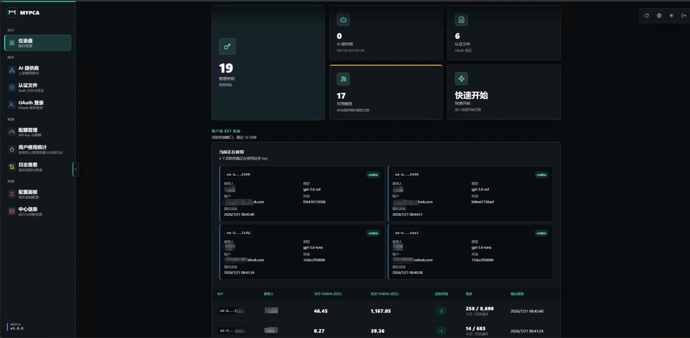

# MYPCA

MYPCA 是一个围绕 **CLIProxyAPI** 定制整理的本地大模型代理与管理项目，包含代理服务端源码、React 管理中心、Codex 用量统计插件源码，以及可直接查看的界面截图。项目目标是把多账号、多提供商、管理面板、配额与用量分析集中在一个工作目录中，方便二次开发、构建和本地部署。

## 界面预览



## 当前功能

- **多模型代理服务**：基于 CLIProxyAPI，提供 OpenAI、Gemini、Claude、Codex、Grok 等兼容接口，支持流式、非流式、工具调用、多模态输入和 WebSocket 能力。
- **多账号调度与负载均衡**：支持 Gemini、OpenAI/Codex、Claude、Grok 等账号池，通过轮询等方式分摊请求。
- **OAuth 与凭据管理**：支持 Codex、Claude、Antigravity、Kimi、xAI/Grok 等授权流程，并支持认证文件上传、下载、删除和状态查看。
- **可视化管理中心**：提供仪表盘、配置编辑、AI 提供商管理、认证文件管理、OAuth、配额管理、日志、系统信息等页面。
- **配置管理**：支持可视化编辑 `config.yaml` 常用字段，也支持源码模式、YAML 高亮、搜索和保存前差异预览。
- **配额与用量能力**：包含 Codex Token Usage 插件源码，用于 Codex 账号池仪表盘、AI 提供商用量分析、额度条、成本估算、导出等能力。
- **插件机制相关代码**：包含 CLIProxyAPI 插件示例、管理 API 示例、执行器/翻译器相关 SDK 代码，便于扩展自定义提供商或处理链路。
- **前端国际化**：管理中心支持英文、简体中文、繁体中文和俄文。
- **本地构建产物整理**：项目目录中保留过构建输出目录，但仓库通过 `.gitignore` 默认忽略构建产物和运行时数据。

## 目录结构

```text
MYPCA/
├── CLIProxyAPICode/                         # CLIProxyAPI 后端 Go 源码与示例
├── Cli-Proxy-API-Management-Center/         # React + TypeScript 管理中心源码
├── CodexTokenUsageCode/                     # Codex Token Usage 插件 Go 源码
├── 界面.png                                  # README 使用的管理界面截图
├── README.md                                # 项目总说明
└── .gitignore                               # Git 忽略规则
```

## 技术栈

- **后端/插件**：Go
- **管理中心前端**：React 19、TypeScript、Vite、Zustand、Axios、SCSS Modules、CodeMirror、i18next
- **前端包管理器**：Bun
- **配置格式**：YAML

## 快速开始

### 1. 构建或运行 CLIProxyAPI 后端

进入后端源码目录：

```bash
cd CLIProxyAPICode
go test ./...
go build -o cli-proxy-api.exe ./cmd/server
```

启动服务前，请根据 `config.example.yaml` 准备自己的 `config.yaml`。真实密钥、账号凭据、日志和运行数据不建议提交到 Git。

### 2. 启动管理中心开发环境

进入管理中心目录：

```bash
cd Cli-Proxy-API-Management-Center
bun install --frozen-lockfile
bun run dev
```

默认访问：

```text
http://localhost:5173
```

页面连接后端时填写 CLIProxyAPI 的 Management API 地址和管理密钥。

### 3. 构建单文件管理页面

```bash
cd Cli-Proxy-API-Management-Center
bun run build
```

管理中心会构建为单文件 HTML，发布流程中通常会作为 `management.html` 随 CLIProxyAPI 服务提供。

### 4. 构建 Codex Token Usage 插件

```bash
cd CodexTokenUsageCode
go test ./...
./build.sh
```

Windows 环境可根据项目脚本或 Go 编译目标生成对应的动态库文件，再放入 CLIProxyAPI 的插件目录。

## 常用开发命令

### 管理中心

```bash
bun run dev        # 启动前端开发服务器
bun run build      # 类型检查并构建
bun run preview    # 本地预览构建产物
bun run test       # 运行 Bun 测试
bun run lint       # 运行 ESLint
bun run verify     # 测试 + lint + 构建
```

### Go 后端/插件

```bash
go test ./...      # 运行 Go 测试
go build ./...     # 编译当前模块
```

## Git 忽略策略

仓库默认忽略以下内容：

- 构建输出：`build/`、`dist/`、前端 `dist/`
- 依赖缓存：`node_modules/`、Bun/Vite/TypeScript 缓存
- 运行数据：日志、用量事件、临时状态、备份目录
- 敏感配置：真实 `config.yaml`、认证文件、环境变量文件
- 编译产物：`.exe`、`.dll`、`.so`、`.dylib` 等

如果需要提交示例配置，请使用 `config.example.yaml` 这类不含真实密钥的文件。

## 安全提示

- 不要提交真实 API Key、OAuth token、认证 JSON、用户用量日志和生产配置。
- 管理密钥与代理 API Key 是不同概念：管理密钥用于访问 Management API，代理 API Key 用于客户端调用模型接口。
- 开启远程管理前，请确认网络访问范围、管理密钥强度和服务端安全配置。

## 许可证

本项目包含的子项目以各自目录中的 `LICENSE` 为准。
